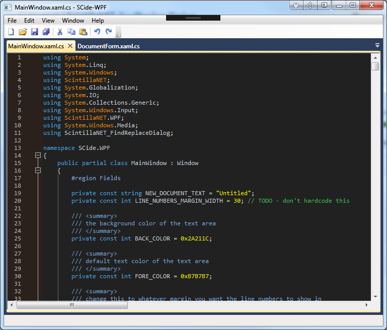

# ScintillaNET.WPF
A WPF Wrapper around the [ScintillaNET v3](https://github.com/jacobslusser/ScintillaNET) control with demo.

### Reference

This project borrows from the follow projects:

* [ScintillaNET v3](https://github.com/jacobslusser/ScintillaNET) is a Windows Forms control, wrapper, and bindings for the versatile [Scintilla](http://www.scintilla.org/) source code editing component.
* [ScintillaNET v2](https://scintillanet.codeplex.com) was the precursor to ScintillaNET v3. It contained a branch for a WPF version which a complete control instead of a wrapper. This is the basis of the project control and demo, with significant rewriting.
* [ScintillaNET.Demo](https://github.com/hgupta9/ScintillaNET.Demo) is a Windows Forms demo application for ScintillaNET. In an effort to keep the Winforms and WPF demos similar, some of the WinForms demo has been incorporated into the WPF demo.
* [ScintillaNET-FindReplaceDialog](https://github.com/Stumpii/ScintillaNET-FindReplaceDialog) A ScintillaNET v3 Find & Replace Dialog + Goto Dialog + Incremental Search. Another of my ScintillaNET projects that was useful to include in the demo.

### Documentation

As noted in the ScintillaNET documenation, ScintillaNET can be used in a WPF form by using the <a href="https://msdn.microsoft.com/en-us/library/system.windows.forms.integration.windowsformshost(v=vs.110).aspx">WindowsFormsHost</a> control. This project wraps the WindowsFormsHost control into a WPF control that can dropped onto a form.

There are some differences between WinForm controls and WPF controls:

#### Colors

WinForms use colours from the System.Drawing namespace, WPF controls use colours from the System.Media namespace. For compatibility with the designer, base ScintillaNET properties use the System.Media colours. To avoid reworking of nested property classes (like Styles) that are not shown in the designer, colour properties use System.Drawing colours.

#### Events

Events in WinForms derive from System.Windows.Forms (i.e. System.Windows.Forms.KeyEventHandler) and WPF events derive from System.Windows.Input. To maintain compatibility, WinForms events have been used.